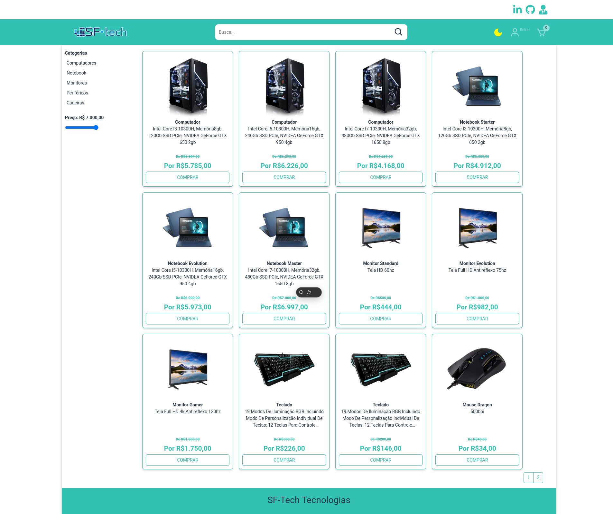
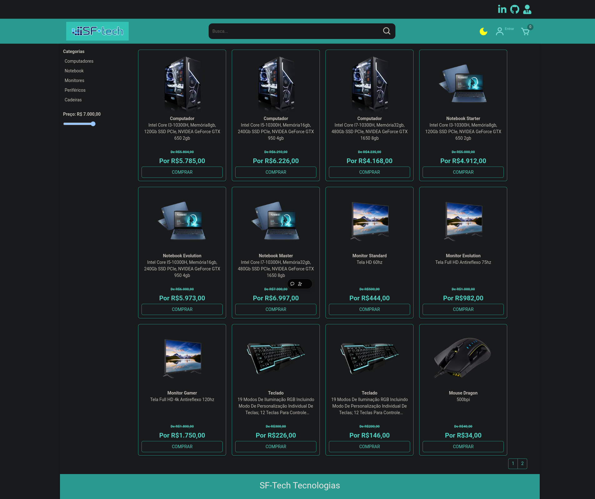

<h1 align="left">Sobre o projeto SfTech</h1>

###

Esse é um projeto pessoal de e-commerce onde utilizei Clean Architecture, Clean Code e as melhores práticas de desenvolvimento frontend. O projeto foi desenvolvido com React.js, Next.js, TypeScript e AWS Cognito para autenticação.

## Demonstração:

  
Este fronted faz parte do projeto portifólio Sf-tech, veja mais em https://sf-tech-front.vercel.app/

  
  
  

## 🛠 Tecnologias utilizadas

<h2 align="left">O frontend foi desenvolvido com as seguintes tecnologias principais:</h2>

React.js – Biblioteca JavaScript para construção de interfaces de usuário.

Next.js – Framework React para desenvolvimento de aplicações web escaláveis e otimizadas.

TypeScript – Tipagem estática para um código mais seguro e robusto.

AWS Cognito – Serviço de autenticação e gerenciamento de usuários na AWS.

Styled-components – Utilizado para estilizar os componentes de maneira modular e reutilizável.

Redux – Gerenciamento de estado previsível e eficiente para a aplicação.

React Query – Gerenciamento de dados de forma simples e eficaz, com caching e sincronização de estado.

React Hook Form – Biblioteca para formulários performáticos em React.

Axios – Cliente HTTP para requisições assíncronas ao backend.

Next Images – Gerenciamento e otimização de imagens para o Next.js.

Outras bibliotecas importantes incluem: react-icons (ícones para a interface), react-redux (bindings do Redux para React), react-responsive-modal (modais responsivos), e mais.

## 📜 Licença

This project is under the MIT license.
Made with 💖 by [Silvio Félix](https://www.linkedin.com/in/silviofelix32/).

Thank you! 🌠
