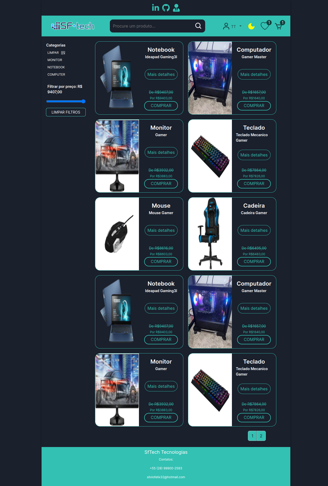

<h1 align="left">Sobre o projeto SfTech</h1>

###

Esse é um projeto pessoal de um e-commerce usando a melhor parte de minhas habilidades no frontend até o momento...

###

<h2 align="left">Esse site foi feito usando:</h2>

###

  
  
  
  
  
  
  
  
  
  
  
  
  

  

## Dependencies

- [axios](https://ghub.io/axios): Promise based HTTP client for the browser and node.js
- [bootstrap](https://getbootstrap.com/): The most popular front-end framework for developing responsive, mobile first projects on the web.
- [cookies-next](https://github.com/andreizanik/cookies-next#readme): Getting, setting and removing cookies on both client and server with next.js.
- [date-fns](https://github.com/date-fns/date-fns#readme): Modern JavaScript date utility library.
- [js-cookie](https://github.com/js-cookie/js-cookie#readme): A simple, lightweight JavaScript API for handling cookies.
- [next](https://nextjs.org): The React Framework.
- [next-images](https://github.com/arefaslani/next-images#readme): Images.
- [nextjs-cors](https://github.com/yonycalsin/nextjs-cors#readme): Nextjs-Cors is a node.js package to provide a middleware that can be used to enable CORS with various options in nextjs applications.
- [polished](https://polished.js.org/): A lightweight toolset for writing styles in Javascript..
- [react](https://ghub.io/react): React is a JavaScript library for building user interfaces.
- [react-data-table-component](https://github.com/jbetancur/react-data-table-component#readme): A simple to use declarative react based data table.
- [react-dom](https://ghub.io/react-dom): React package for working with the DOM.
- [react-hook-form](https://www.react-hook-form.com): Performant, flexible and extensible forms library for React Hooks.
- [react-icons](https://ghub.io/react-icons): SVG React icons of popular icon packs using ES6 imports.
- [react-input-mask](https://github.com/sanniassin/react-input-mask): Masked input component for React.
- [react-pro-sidebar]: high level and customizable side navigation.
- [react-redux](https://github.com/reduxjs/react-redux): Official React bindings for Redux.
- [react-responsive-modal](https://react-responsive-modal.leopradel.com/): A simple responsive and accessible react modal.
- [react-switch](https://github.com/markusenglund/react-switch#readme): Draggable toggle-switch component for react.
- [redux](http://redux.js.org): Predictable state container for JavaScript apps.
- [styled-components](https://ghub.io/styled-components): Visual primitives for the component age. Use the best bits of ES6 and CSS to style your apps without stress.
- [uuid](https://ghub.io/uuid): RFC4122 (v1, v4, and v5) UUIDs.

# :page_facing_up: License

This project is under the [MIT license](./LICENSE).
Made with 💖 by [Silvio Félix](https://www.linkedin.com/in/silviofelix32/).

Thank you! 🌠

###
